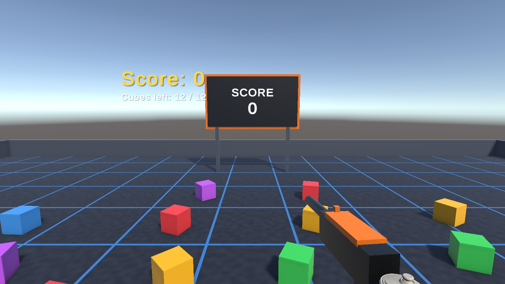

# VR Cube Shooter (Unity XR)

A VR shooting game made with Unity, OpenXR and the XR Interaction Toolkit. Each pull of the gun's trigger fires; hitting a cube on the plane destroys it and gains a point. The score is shown in your view and on a scoreboard.

## Features
- Gun on the right controller: trigger fires with muzzle flash, tracer, recoil, sound and haptics
- 12 coloured cubes on the plane; each hit destroys the cube and adds 1 point
- Score HUD in view plus a world scoreboard; a new wave spawns after all cubes are cleared
- Meta Quest (Android) build via OpenXR
- **Desktop Mode**: playable on a PC without a headset (mouse aim, click to shoot)
- PlayMode tests

## Controls
| Input | Action |
|---|---|
| Right trigger (VR) | Shoot |
| Mouse (PC) | Aim |
| Left click / Space / F (PC) | Shoot |
| W A S D (PC) | Move |

## Open the project
1. Install **Unity 6000.4.0f1** (Unity 6) with Unity Hub (add **Android Build Support** for Meta Quest).
2. Unity Hub -> **Add -> Add project from disk** -> select this folder.
3. Open `Assets/Scenes/VRShooter.unity` and press **Play**.

## Build
Menu **VR Shooter -> Build Quest APK / Build Windows (PC VR)**.

## Main scripts
`Gun`, `Target`, `TargetSpawner`, `ScoreManager`, `ScoreUI`, `DesktopMode` (in `Assets/Scripts`). The editor builder in `Assets/Scripts/Editor` generates the scene, materials and prefabs.

## Tests
Run **Window -> General -> Test Runner -> PlayMode -> Run All**.

Built with **Unity 6000.4.0f1**.
